# Amazon_Vine_Analysis

## Overview of Analysis
### Purpose
The purpose of this analysis is to compare the number of 5 star reviews coming from people participating in the Vine program to those coming from people who are not participating in the Vine program. In particular I am interested in the total number of Vine and Non-Vine reviews, the number of 5-Star Vine and Non-Vine Reviews, and the Percentage of 5-Star Vine and Non-Vine reviews.

### Data
For this analysis I chose to review the Baby category.

## Results
### Process
Using PySpark to import the data into a Spark Dataframe, I then filtered the dataframe to show only the necessary information

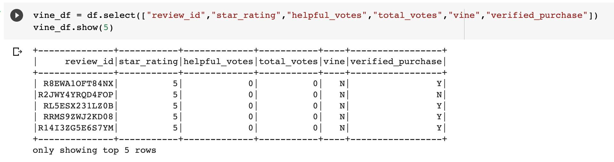

Next, I filtered the dataframe to show only results with at least 20 votes

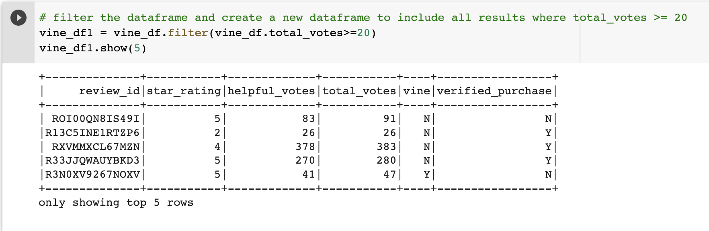

Then, I filtered that dataframe to give me a new dataframe with reviews whose votes were at least 50% 'helpful'
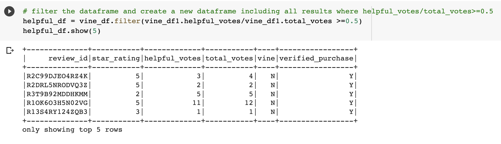

Next, I created two dataframes - one with paid Vine reviews, the other with unpaid reviews.
#### Vine Reviews
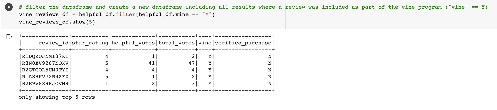
#### Non-Vine Reviews
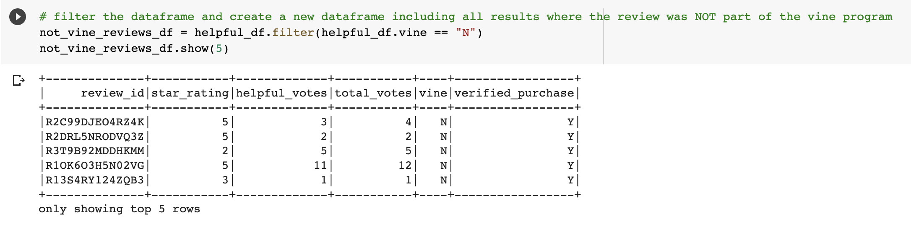

Next, I performed the analysis on those two dataframes (vine_reviews_df and not_vine_reviews_df) to answer the following questions.

### Number of Vine Reviews and Non-Vine Reviews
There are 5028 total Vine Reviews and 495,942 total Non-Vine reviews in the Baby category.
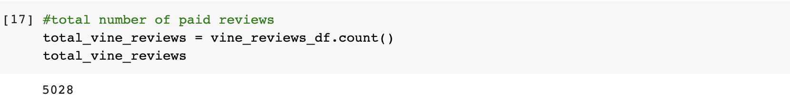
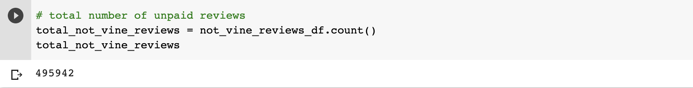

### Number of 5-star Vine Reviews and 5-star Non-Vine Reviews
There are 2368 5-Star Vine Reviews and 265,843 5-Star Non-Vine Reviews in the Baby category.
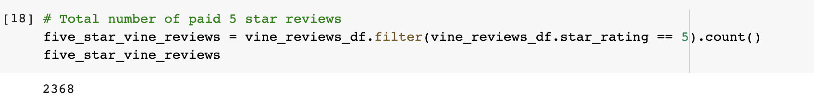
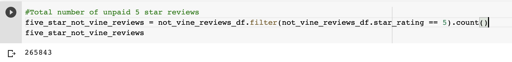

### What percentage of Vine reviews were 5 star? What percentage of Non-Vine reviews were 5 star?
47.1% of Vine reviewers left 5-Star reviews vs 53.6% of Non-Vine reviewers left 5-Star reviews in the Baby Category.
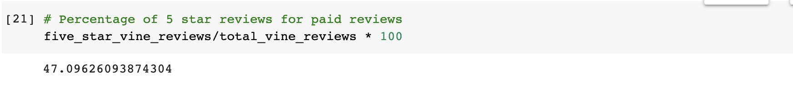
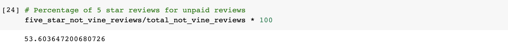

## Summary

### Positivity Bias
Because the percentage of 5-Star reviews from Vine reviewers is 6 percentage points lower than for non-Vine reviewers, it appears that there is NO positivity bias for the Vine reviewers.

### Additional Analysis
Another question that would be interesting to answer is what is the average star-rating left by a Vine reviewer vs a non-Vine reviewer. It is possible that while the non-Vine reviewers leave 6% more 5-star reviews, the average rating for a Vine reviewer could still be higher, which could indiate a positivty bias after all.

Performing the same analysis as above but with 4-star reviews could provide additional insight into the question of whether a Vine Reviewer is more likely to leave a positive review than a non-Vine reviewer. 

